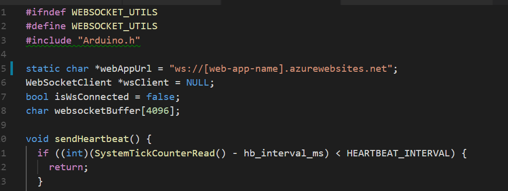

# DevKit Music Player

## Overview
In this project, we use two Devkits to build a music player. This two Devkits are connected with serial and can perform basic music control operations with voice.

## Prerequisites
1. Setup IoT DevKit development environment by following [Get Started](https://microsoft.github.io/azure-iot-developer-kit/docs/get-started/) and have one DevKit connect to Wi-Fi.
2. Install [Visual Studio 2017](https://docs.microsoft.com/en-us/visualstudio/install/install-visual-studio)
3. `git clone https://github.com/ab-sin-the/devkit-music-player` 
4. `cd devkit-music-player`

## Step 1: Upload the sketch file in VoiceRecorder to one of Devkits.

## Step 2: Create Storage Account
1. Log in to the [Azure portal](http://portal.azure.com/).

    > **Note**: If you do not already have a subscription, you can register for a [free account](https://azure.microsoft.com/en-us/free/).

2. Click **Create new resource** link found on the upper left-hand corner of the Azure portal, then select **Storage > Storage account - blob, file, table, queue**. A new blade will open with information about the **Blob Storage**.

3. Click **Create** to create the service. Choose a location near your network. This process may take several minutes.

4. After the storage account is created, click **Blob**, then create a container.

5. Upload your music to the container. Make sure that the music is named '1.wav', '2.wav' ....

    

6. Change **Public access level** of **Access Policy** from **Private** to **Blob**.

    

7. Record the **storageAccountName**, **storageKey** of your storage account and **Url** of your blob storage.

    

    

## Step 2: Deploy Web Socket to the Cloud
In previous steps, you've created a storage account. Now we need to deploy a web socket to connect the music in the blob with Devkit.

Please follow the steps below to deploy your Web Socket.

1. Launch **Visual Studio 2017** and open the web socket solution file *WebSocketServer.sln* under folder *WebSocketServer*.

2. Open *WebsocketController.cs* under folder *Controllers*.

3. Modify three variables which you record in the previous step.

    

4. Right click on the project file and select **Publish** tab.

5. Publish this project to a existing web service or a new web service.

6. Turn on web socket option in the web service.

    

## Step 3: build and upload music player application to the DevKit

1. Navigate to the **Device** folder in the root of your local repo, and open this folder with *Visual Studio Code*.

2. Connect the IoT DevKit to your computer via Micro-USB cable.

3. Open **WebSocketUtils.h**. Find and replace `[web-app-name]` with the Azure Web App name you've create in Step 3.

    

4. Use IoT Workbench extension or Arduino extension to build and upload the code to the DevKit.

5. The output window shows whether the task was successful.

## Play with Devkit Music Player

1. Press **Reset** button on the DevKit to restart your device application.

    *Note: Please ensure your DevKit is connected to Wi-Fi.*

2. After the DevKit connect to Wi-Fi successfully, press button A to start a convercation.

3. Hold down button B to talk, and release button B when you finish your voice command.

4. Wait a few seconds for service to process the voice command.

5. The DevKit will play back the response audio via the headphone output on your DevKit. You can hear the audio via headphone connected to it.